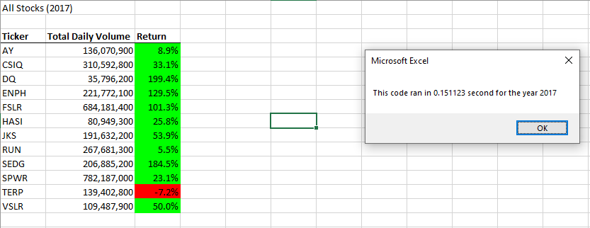
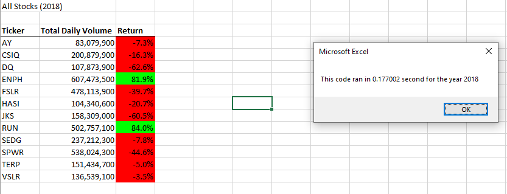

# stock-analysis

## Overview of Project
Utilizing historical data, this project seeks to utilize dataset of the entire stock market over the last few years, specifically year 2017 and 2018. VBA programming will be used as the main tool to analyze the dataset. Past codes will be used to leverage data, by way of either refactoring or editing previously used codes from the Module 2 solution. This will be acheived by switching between the nesting order of `for` loops.

### Purpose
The purpose of this analysis is to determine whether refactoring the code successfully made the VBA programming faster or not. 

## Results
Analysis of this project was performed using VBA programming to mine, analyze and visualize the data. This workbook uses VBA to assess stock dataset and list them into a short summary which details 
1. Stock Name
2. Total Volume of each stock for that year
3. Stock Return

As mentioned previously, code was refactored to create a version that not only be faster but more efficient at performing the analysis  

Two analysis was conducted during this research excercise. They are:
1. Comparing the stock performance between 2017 and 2018
2. Comparing the execution times of the original script and the refactored script

### Compare the stock performance between 2017 and 2018

Based on the stock performance between year 2017 and year 2018, Steve could show and recommend to his parents the `ENPH` and `RUN` stocks as they showed growth in their returns consistentlty over the years. Majority of the stocks that showed positive growth in year 2017 showed a decline in growth in 2018, much like the stock Steve's parents were interested in i.e "DQ" which indicated a `+199%` return in 2017 and a `-63%` loss in 2018. On the other hand we do have stocks that have been performing poorly consistently over the two (2) years such as `TERP` ticker as it shows a steady decline with `-7%` loss in 2017 and `-5%` in 2018. Please see the images below:

 **Image 1: Showing All stocks ticker performance in the year 2017:**

 **Image 2: Showing All stocks ticker performance in the year 2018:**

### Compare the execution times of the original script and the refactored script
The original script in 2017 ran at `0.8320313` seconds whilst in the refactored script it ran at `0.151123` seconds. This indicates that the refactored scripted performed faster by `0.68` seconds. The code was ran also in 2018, it ran at `0.8359375` second for the old script and `0.177002` seconds in the refactored script. Similar to the 2017 script, it demonstrated that the refactored script performed the analysis faster by `0.66` seconds. See image 1 and 2 above which also indicates the execution times year 2017 and 2018 of the refactored scipts.

## Summary

### What are the advantages or disadvantages of refactoring code?
>**Advantages:** When you refactor a code the intent is to create a much simpler and cleaner code, one which is much easier understood, and perfom the job or task much faster, thus increasing performance

>**Disadvantages:** Refactoring a code can be time consuming if not done correctly, and one might introduce more errors or bugs into the code. Doing so have the potential of making things more complex, and even more expensive.

### How do these pros and cons apply to refactoring the original VBA script?
>Refactoring the original code proved to be a challenging one, bugs and errors kept on occuring one in particular remained consistent i.e error overflow; the outputs of the starting and ending prices where not beeing stored correctly. It took hours to sort through the code to find the error. Understanding the code is another crucial compnent here, if the coder does not have a good grasp of the intricacies and details that goes into the code, debugging the code could prove to be tedious, hence leaving notes/comments about the code is essential. 

>In hindsight, the refactored code has shown to be a much faster, cleaner code. It not only improved the design of the analysis but once done correctly, made for a much easier code to read and understand.

